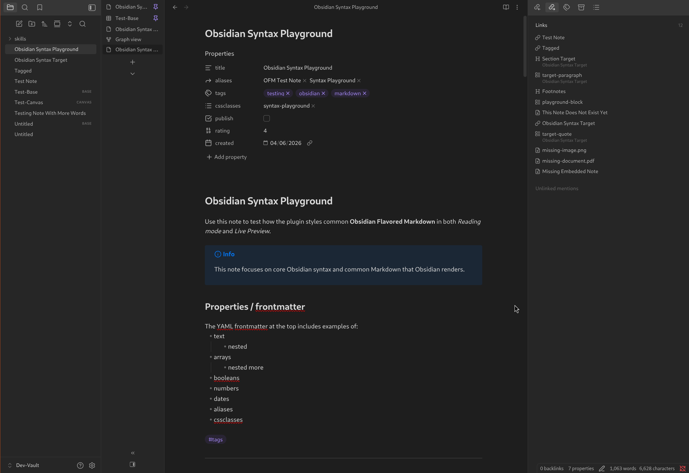

# Just Vertical Tabs 

Enables you to have note tabs aligned vertically instead of horizontally. 

## Features 

- Vertical Tabs 
- Orient tab bar on the left, or the right
- Right-sidebar toggle placement options: default, note header, or bottom of the vertical tab bar
- Optional tab icons toggle
- Command + setting to collapse the tab bar down to icons, or title initials when icons are hidden
- Collapse/expand button in the vertical tab bar above the right sidebar toggle
- Optional toggle to hide/show the collapse/expand button

## Installation

1. Install and enable [BRAT](https://github.com/TfTHacker/obsidian42-brat) through the Community Plugins
2. Open the Obsidian settings, and navigate to the BRAT settings page
3. Click the "Add beta plugin" button
4. Paste the link to this repository in the Repository field
5. Make sure the "Enable after installing the plugin" box is checked
6. Click the "Add plugin" button
